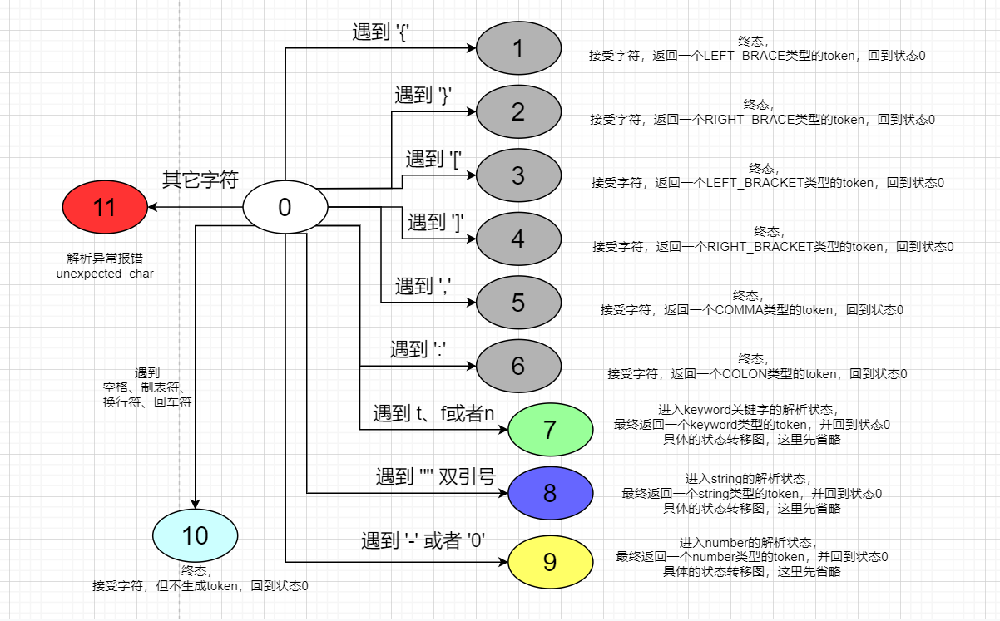

# 从零开始实现一个简单的json解析器

## 1. MySimpleJsonParser介绍
最近正在学习编译原理相关的知识，为了加深对词法分析、语法分析阶段中诸如有穷自动机、自顶向下语法分析、AST等概念的理解，所以选择了json解析器作为练手的对象。  
#####
通过实现json解析器来学习编译原理前端知识有以下几个优点：
1. json作为一种轻量级的数据交换格式，在日常的工作天天都会接触到，对json的语法非常熟悉，没有额外的学习成本 
2. 作为学习编译原理的入门新手，用于练手的语言其词法和语法不能太复杂，否则无论是理解还是正确的实现解析器都会非常困难，而让人产生挫败感。而json的词法和语法足够简单，在语法分析时只需要简单判断下一个token即可确定AST生成的方向。
3. json并不是一个真正的编程语言，其完全不需要后端的运行时，可以认为将json文本转换成正确的AST就算完成了任务。实现基于AST对原始的json文本进行beauty格式化输出的功能就能产生一定的成就感。
#####
在本篇博客中，我们将基于java语言，不依赖任何第三方库，从零开始实现一个简单的json解析器：MySimpleJsonParser。  其包括以下几个主要模块：  
1. 一次性生成所有token的静态json词法分析器StaticJsonLexer
2. 惰性按需解析token的流式json词法分析器StreamJsonLexer
3. 基于递归实现的json语法解析器RecursiveJsonParser
4. 基于堆栈实现的json语法解析器StackBaseJsonParser
5. json的AST数据结构JsonElement及其子类，以及生成AST对应beauty json字符串的工具类

## 2. json词法分析实现
下面我们先研究一下json的文法，官方文档地址：https://www.json.org/json-en.html 。可以看到，json的主要结构有几种：
1. string结构：由双引号包围的任意数量Unicode字符的集合，使用反斜线转义。一个字符（character）也可以是一个单独的字符串（character string）。
2. number结构：由“0”或“-”开头的数值字面量，可以是整数、小数、负数或者是包含一个E/e符号的指数。
3. object结构：其以 “{” 开头，以 “}” 结尾。
4. array结构：其以“[” 开头,以 “]” 结尾。
5. value结构：可以是string、number、true(关键字)、false(关键字)、 null(关键字)、object或者array。
6. whitespace结构：由任意个space空格、linefeed换行符、carriage return回车符以及tab制表符组成，本身无意义，仅起到分割的作用。
#####
仔细分析后，发现string结构、number结构和whitespace结构都是基本结构，其自身无法再嵌套其它结构，因此其都是最终AST中的叶子节点，而object、array和value都是可以互相嵌套的复合结构，因此其都是AST中的非叶子节点。   
对于这些可嵌套的非AST叶子节点，必须在语法分析中才能完成解析；而string结构、number结构、false、true、null关键字以及“{”、“]”等特殊符号，则适合在词法分析中完成解析。   
因为json语法中，无论原始的json字符串中一个number字面量有多复杂(比如-2.03214e+6605218)，在语法分析中都只需要当做一个完整的number类型的token来处理即可。   
词法分析专注于局部，将原始的字符流按照词法规则正确的转换为token流；而语法分析则专注于将token流按照语法规则转换为正确的AST树结构。  
通过将整个分析流程，有机的分解为词法分析和语法分析等等不同步骤，每个步骤都依赖于前一个步骤的产出的分层设计，能够很好的控制解析器整体的复杂度，方便调试的同时性能上也有很大的提升。  
因此，除了少数非常简单的语言外，几乎所有的编译器都会采用分层的架构来实现整体的功能。
### 2.1 token类型定义
从json的官方文档定义的文法中可以看到，json中允许的token类型共分为三类：
1. 诸如“{”、“}”、“[”、“]”、“,”,“:”,“"”等独立的字符是json中的特殊符号
2. 完整且独立的true、false、null被视为关键字
3. number、string这两种复杂字符流
#####
因此我们可以先定义出json的token类型枚举。其中EOF类型是额外的，用于在完成整个字符流的词法分析后，追加到token流的最后，标志着token流的结束。
```java
public enum JsonTokenTypeEnum {
    LEFT_BRACE("{"),
    RIGHT_BRACE("}"),

    LEFT_BRACKET("["),
    RIGHT_BRACKET("]"),

    COMMA(","),
    COLON(":"),

    TRUE("true"),
    FALSE("false"),
    NULL("null"),

    STRING("string"),
    NUMBER("number"),

    EOF("EOF"),
    ;
    private final String key;

    JsonTokenTypeEnum(String key) {
        this.key = key;
    }

    public String getKey() {
        return key;
    }
}
```
### 2.2 词法分析器整体框架与特殊字符的词法分析
现在我们已经知道诸如“{”、“]”等独立字符是json中的特殊符号，但是当我们在字符流中遇到了一个“{”字符时，并不能无脑的将其作为一个LEFT_BRACE类型的token来处理。因为如果其是被双引号包裹的，作为string类型token内容的一部分，那么就并不能将其直接当做独立的token来对待。  
所以，词法分析中一班使用有限状态自动机来解决这个问题，在判断如何处理字符流时并不仅仅取决于下一个字符是什么，而还要结合当前自动机的状态来决定行为。  
以上述对“{”字符的处理为例，如果是在初始化状态下(已经完成了一个完整token的解析,准备开始解析下一个新token)，碰到“{”字符时可以确定的将其转化为LEFT_BRACE类型的token，但是当自动机处于string类型token的解析状态时，则需要将其作为string类型token内容的一部分。  
##### json词法分析自动机总览图
基于官方文档中的json文法规则，我们可以设计出一个如下图所示的json有限状态自动机来实现我们的词法分析。

#####
* 在json解析一开始，自动机位于状态0，随后便会基于字符流的下一个字符的类型进行状态转换，在读取到诸如“{”、“[”、“,”等独立符号时，便会直接接收该字符，推进字符流，同时生成对应类型的token。  
* 在完整的解析出一个完整token后，自动机便会重新回到状态0，准备尝试解析下一个新的token。状态0只能合法的接收有限种类的字符，对于不符合json文法的字符将认为当前字符流不是合法的json字符串而直接报错，退出解析。
* 对于更复杂的string类型、number类型token的解析，我们放在后面的小节再展开，总览图中暂时省略。
##### 静态的词法分析器实现
```java
public class StaticJsonLexer extends AbstractJsonLexer{

    public StaticJsonLexer(String jsonString) {
        super(jsonString);
    }

    /**
     * 一次完整的扫描，非流式的处理
     * */
    public List<JsonToken> doLex(){
        char[] chars = super.jsonStringArray;

        // 相当于是状态0
        while(doLexContext.currentIndex < chars.length){
            char ch = chars[doLexContext.currentIndex];

            switch(ch){
                case '{':
                    doLexContext.tokenCollector.add(new JsonToken(JsonTokenTypeEnum.LEFT_BRACE));
                    doLexContext.currentIndex++;
                    break;
                case '}':
                    doLexContext.tokenCollector.add(new JsonToken(JsonTokenTypeEnum.RIGHT_BRACE));
                    doLexContext.currentIndex++;
                    break;
                case '[':
                    doLexContext.tokenCollector.add(new JsonToken(JsonTokenTypeEnum.LEFT_BRACKET));
                    doLexContext.currentIndex++;
                    break;
                case ']':
                    doLexContext.tokenCollector.add(new JsonToken(JsonTokenTypeEnum.RIGHT_BRACKET));
                    doLexContext.currentIndex++;
                    break;
                case ',':
                    doLexContext.tokenCollector.add(new JsonToken(JsonTokenTypeEnum.COMMA));
                    doLexContext.currentIndex++;
                    break;
                case ':':
                    doLexContext.tokenCollector.add(new JsonToken(JsonTokenTypeEnum.COLON));
                    doLexContext.currentIndex++;
                    break;
                case '"':
                    doLexContext.tokenCollector.add(parseString(chars, doLexContext));
                    break;
                case 't':
                    // 尝试解析true关键字
                    doLexContext.tokenCollector.add(parseTrueKeyword(chars, doLexContext));
                    break;
                case 'f':
                    // 尝试解析false关键字
                    doLexContext.tokenCollector.add(parseFalseKeyword(chars, doLexContext));
                    break;
                case 'n':
                    // 尝试解析null关键字
                    doLexContext.tokenCollector.add(parseNullKeyword(chars, doLexContext));
                    break;
                default:
                    // 其它case
                    if(ch == '-' || CommonStringUtil.is0_9(ch)){
                        // number解析
                        JsonToken numberToken = parseNumber(chars, doLexContext);
                        doLexContext.tokenCollector.add(numberToken);
                        break;
                    }else if(CommonStringUtil.isWhitespace(ch)){
                        // whiteSpace 直接跳过
                        doLexContext.currentIndex++;
                        break;
                    }else{
                        throw new MuJsonParserException("unexpected character: " + ch + " at index " + doLexContext.currentIndex);
                    }
            }
        }

        // 最后加上EOF
        doLexContext.tokenCollector.add(new JsonToken(JsonTokenTypeEnum.EOF));
        return doLexContext.tokenCollector;
    }
}
```
```java
public abstract class AbstractJsonLexer {

    protected final char[] jsonStringArray;

    protected final DoLexContext doLexContext;

    public AbstractJsonLexer(String jsonString) {
        this.jsonStringArray = jsonString.toCharArray();
        this.doLexContext = new DoLexContext();
    }

    protected JsonToken parseNumber(char[] chars, DoLexContext doLexContext){
        // number类型的内容
        String numberStr = new NumberLexStatemachine().tryParse(chars,doLexContext);

        return new JsonToken(JsonTokenTypeEnum.NUMBER, numberStr);
    }

    protected JsonToken parseString(char[] chars, DoLexContext doLexContext){
        // string类型的内容
        String stringStr = new StringLexStatemachine().tryParse(chars,doLexContext);

        return new JsonToken(JsonTokenTypeEnum.STRING, stringStr);
    }

    protected JsonToken parseTrueKeyword(char[] chars, DoLexContext doLexContext){
        // true关键字
        String stringStr = new KeywordTrueLexStatementMachine().tryParse(chars,doLexContext);

        return new JsonToken(JsonTokenTypeEnum.TRUE, stringStr);
    }

    protected JsonToken parseFalseKeyword(char[] chars, DoLexContext doLexContext){
        // false关键字
        String stringStr = new KeywordFalseLexStatementMachine().tryParse(chars,doLexContext);

        return new JsonToken(JsonTokenTypeEnum.FALSE, stringStr);
    }

    protected JsonToken parseNullKeyword(char[] chars, DoLexContext doLexContext){
        // null关键字
        String stringStr = new KeywordNullLexStatementMachine().tryParse(chars,doLexContext);

        return new JsonToken(JsonTokenTypeEnum.NULL, stringStr);
    }
}
```
#####
* 为了支持后续流式的词法分析器，静态的词法分析器StaticJsonLexer继承自AbstractJsonLexer类，构造方法中接收一个字符串，并通过方法doLex进行解析，返回一次性完整解析字符串后的token列表。  
* doLex方法中是一个while循环，每一次循环开始都相当于是自动机位于状态0，在解析时会通过自增currentIndex不断地推进字符流，成功解析出完整的token后便会将新的token保存到上下文中的tokenCollector中。  
  只有在解析报错或者成功完成了整个字符串的解析后才会退出循环
* 在正常退出while循环后，在token集合的尾部追加一个特殊的EOF类型的token，用于告知下一阶段的parser已经解析到了token流的末尾，该结束解析了。
### 2.3 number类型的词法分析


### 2.4 string类型的词法分析

### 2.5 关键字的词法分析


## 3. json语法分析实现

## 4. 基于AST生成beauty json字符串

## 5. 总结