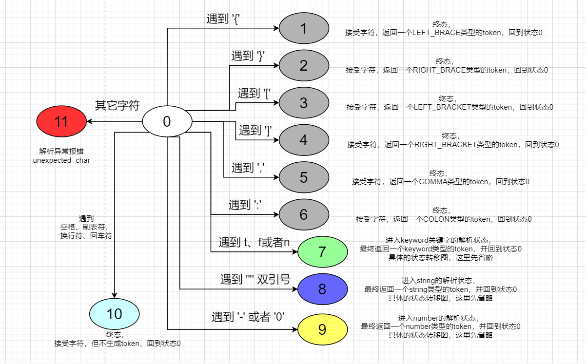
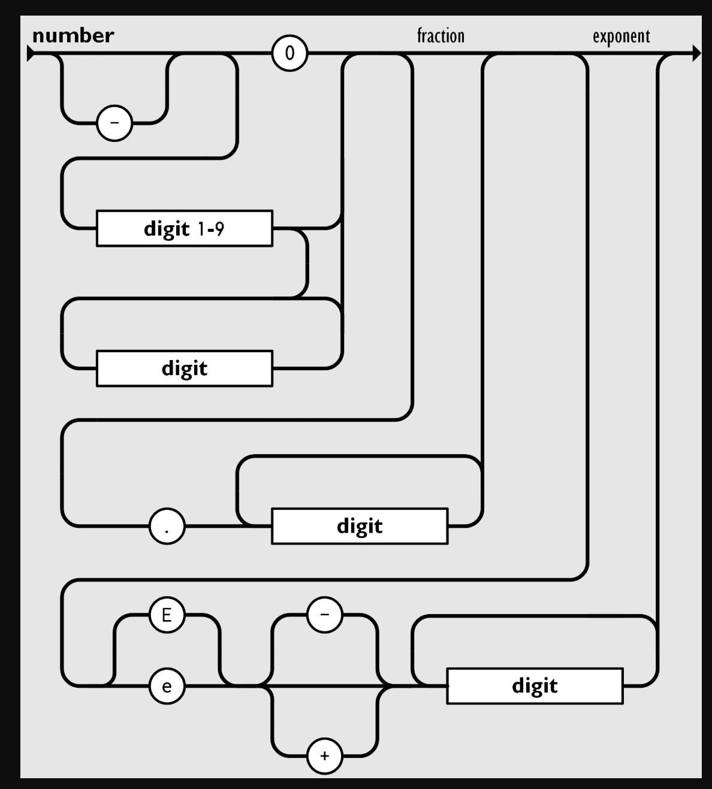
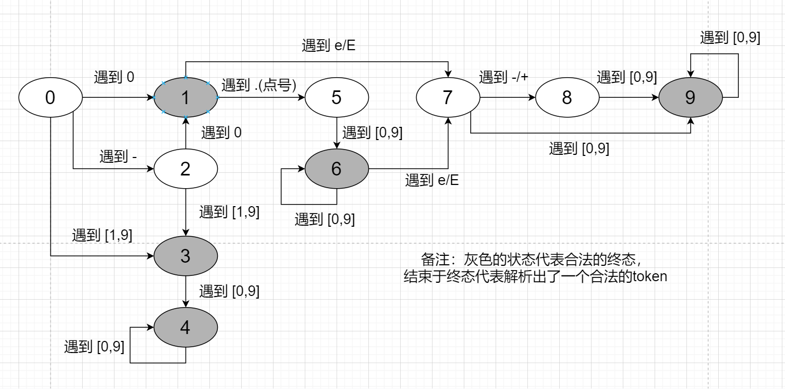
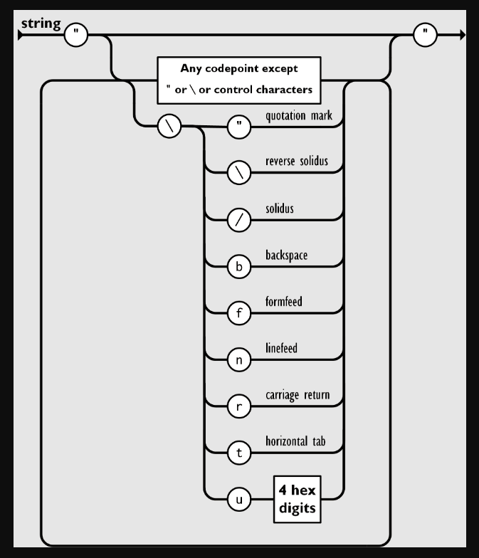
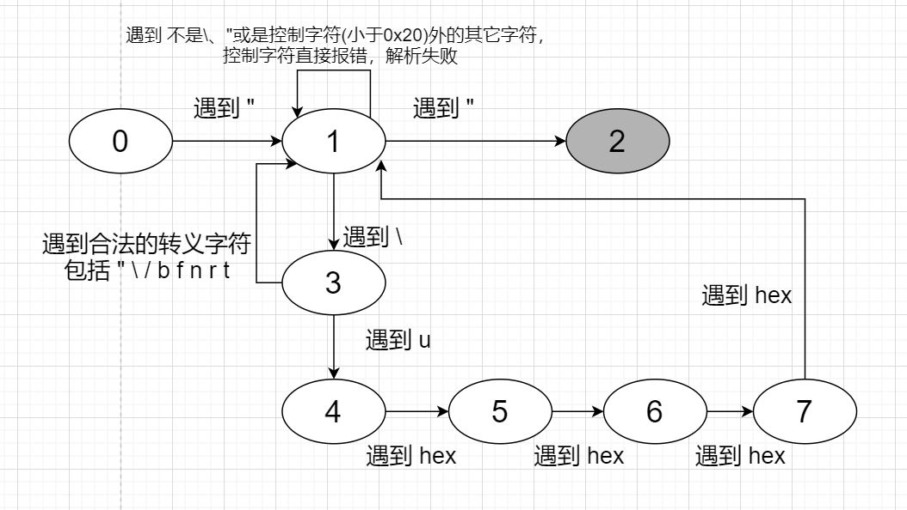
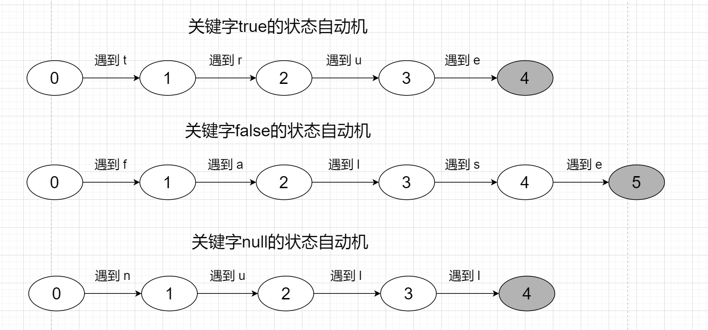
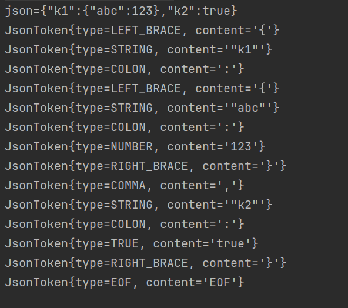
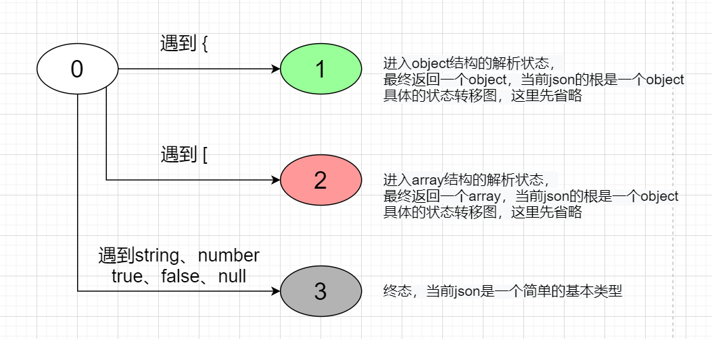
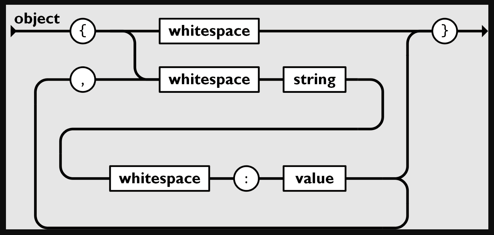

# 从零开始实现一个简单的json解析器

## 1. MySimpleJsonParser介绍
最近正在学习编译原理相关的知识，为了加深对词法分析、语法分析阶段中诸如有穷自动机、自顶向下语法分析、AST等概念的理解，所以选择了json解析器作为练手的对象。  
#####
通过实现json解析器来学习编译原理前端知识有以下几个优点：
1. json作为一种轻量级的数据交换格式，在日常的工作几乎每天都会接触，没有什么额外的学习成本。
2. 作为学习编译原理的入门新手，用于练手的语言其词法和语法不能太复杂，否则无论是理解还是正确实现编译器/解释器都会很困难，让人产生挫败感。而json的词法和语法足够简单，在语法分析时只需要简单判断下一个token即可确定AST生成的方向。
3. json并不是一个编程语言，其完全不需要后端的运行时，可以认为将json文本转换成正确的AST就算完成了任务。初学者能实现基于AST对原始json文本进行beauty格式化输出的功能就能产生一定的成就感。
#####
在本篇博客中，我们将基于java语言，不依赖任何第三方库，从零开始实现一个简单的json解析器：MySimpleJsonParser。其包括以下几个主要模块：    
1. 一次性解析完出全部token的静态json词法分析器StaticJsonLexer
2. 按需惰性解析token的流式json词法分析器StreamJsonLexer
3. 基于递归实现的json语法解析器RecursiveJsonParser
4. 基于堆栈实现的json语法解析器StackBaseJsonParser
5. json的AST数据结构JsonElement及其子类，以及生成AST对应beauty json字符串的工具类

## 2. json词法分析实现
下面我们先研究一下json的文法，官方文档地址：https://www.json.org/json-en.html 。可以看到，json的主要结构有几种：
1. string结构：由双引号包围的任意数量Unicode字符的集合，使用反斜线转义。一个字符（character）也可以是一个单独的字符串（character string）。
2. number结构：由“0”或“-”开头的数值字面量，可以是整数、小数、负数或者是包含一个E/e符号的指数。
3. object结构：其以 “{” 开头，以 “}” 结尾。
4. array结构：其以“[” 开头,以 “]” 结尾。
5. value结构：可以是string、number、true(关键字)、false(关键字)、 null(关键字)、object或者array。
6. whitespace结构：由任意个space空格、linefeed换行符、carriage return回车符以及tab制表符组成，本身无意义，仅起到分割的作用。
#####
仔细分析后，发现string结构、number结构和whitespace结构都是基本结构，其自身无法再嵌套其它结构，因此其都是最终AST中的叶子节点，而object、array和value都是可以互相嵌套的复合结构，因此其都是AST中的非叶子节点。   
对于这些可嵌套的非AST叶子节点，必须在语法分析中才能完成解析；而string结构、number结构、false、true、null关键字以及“{”、“]”等特殊符号，则适合在词法分析中完成解析。   
因为json语法中，无论原始的json字符串中一个number字面量有多复杂(比如-2.03214e+6605218)，在语法分析中都只需要当做一个完整的number类型的token来处理即可。   
词法分析专注于局部，将原始的字符流按照词法规则正确的转换为token流；而语法分析则专注于将token流按照语法规则转换为正确的AST树结构。  
通过将整个分析流程，有机的分解为词法分析和语法分析等等不同步骤，每个步骤都依赖于前一个步骤的产出的分层设计，能够很好的控制解析器整体的复杂度，方便调试的同时性能上也有很大的提升。  
因此，除了少数非常简单的语言外，几乎所有的编译器都会采用分层的架构来实现整体的功能。
### 2.1 token类型定义
从json的官方文档定义的文法中可以看到，json中允许的token类型共分为三类：
1. 诸如“{”、“}”、“[”、“]”、“,”,“:”,“"”等独立的字符是json中的特殊符号
2. 完整且独立的true、false、null被视为关键字
3. number、string这两种复杂字符流
#####
因此我们可以先定义出json的token类型枚举。其中EOF类型是额外的，用于在完成整个字符流的词法分析后，追加到token流的最后，标志着token流的结束。
```java
public enum JsonTokenTypeEnum {
    LEFT_BRACE("{"),
    RIGHT_BRACE("}"),

    LEFT_BRACKET("["),
    RIGHT_BRACKET("]"),

    COMMA(","),
    COLON(":"),

    TRUE("true"),
    FALSE("false"),
    NULL("null"),

    STRING("string"),
    NUMBER("number"),

    EOF("EOF"),
    ;
    private final String key;

    JsonTokenTypeEnum(String key) {
        this.key = key;
    }

    public String getKey() {
        return key;
    }
}
```
### 2.2 词法分析器整体框架与特殊字符的词法分析
现在我们已经知道诸如“{”、“]”等独立字符是json中的特殊符号，但是当我们在字符流中遇到了一个“{”字符时，并不能无脑的将其作为一个LEFT_BRACE类型的token来处理。因为如果其是被双引号包裹的，作为string类型token内容的一部分，那么就并不能将其直接当做独立的token来对待。  
所以，词法分析中一般使用有限状态自动机来解决这个问题，在判断如何处理字符流时并不仅仅取决于下一个字符是什么，而还要结合当前自动机的状态来决定行为。  
以上述对“{”字符的处理为例，如果是在初始化状态下(已经完成了一个完整token的解析,准备开始解析下一个新token)，碰到“{”字符时可以确定的将其转化为LEFT_BRACE类型的token，但是当自动机处于string类型token的解析状态时，则需要将其作为string类型token内容的一部分。  
##### json词法分析自动机总览图
基于官方文档中的json文法规则，我们可以设计出一个如下图所示的json有限状态自动机来实现我们的词法分析。

#####
* 在json解析一开始，自动机位于状态0，随后便会基于字符流的下一个字符的类型进行状态转换，在读取到诸如“{”、“[”、“,”等独立符号时，便会直接接收该字符，推进字符流，同时生成对应类型的token。  
* 在完整的解析出一个完整token后，自动机便会重新回到状态0，准备尝试解析下一个新的token。状态0只能合法的接收有限种类的字符，对于不符合json文法的字符将认为当前字符流不是合法的json字符串而直接报错，退出解析。
* 对于更复杂的string类型、number类型token的解析，我们放在后面的小节再展开，总览图中暂时省略。
##### 静态的词法分析器实现
```java
public class StaticJsonLexer extends AbstractJsonLexer{

    public StaticJsonLexer(String jsonString) {
        super(jsonString);
    }

    /**
     * 一次完整的扫描，非流式的处理
     * */
    public List<JsonToken> doLex(){
        char[] chars = super.jsonStringArray;

        // 相当于是状态0
        while(doLexContext.currentIndex < chars.length){
            char ch = chars[doLexContext.currentIndex];

            switch(ch){
                case '{':
                    doLexContext.tokenCollector.add(new JsonToken(JsonTokenTypeEnum.LEFT_BRACE));
                    doLexContext.currentIndex++;
                    break;
                case '}':
                    doLexContext.tokenCollector.add(new JsonToken(JsonTokenTypeEnum.RIGHT_BRACE));
                    doLexContext.currentIndex++;
                    break;
                case '[':
                    doLexContext.tokenCollector.add(new JsonToken(JsonTokenTypeEnum.LEFT_BRACKET));
                    doLexContext.currentIndex++;
                    break;
                case ']':
                    doLexContext.tokenCollector.add(new JsonToken(JsonTokenTypeEnum.RIGHT_BRACKET));
                    doLexContext.currentIndex++;
                    break;
                case ',':
                    doLexContext.tokenCollector.add(new JsonToken(JsonTokenTypeEnum.COMMA));
                    doLexContext.currentIndex++;
                    break;
                case ':':
                    doLexContext.tokenCollector.add(new JsonToken(JsonTokenTypeEnum.COLON));
                    doLexContext.currentIndex++;
                    break;
                case '"':
                    doLexContext.tokenCollector.add(parseString(chars, doLexContext));
                    break;
                case 't':
                    // 尝试解析true关键字
                    doLexContext.tokenCollector.add(parseTrueKeyword(chars, doLexContext));
                    break;
                case 'f':
                    // 尝试解析false关键字
                    doLexContext.tokenCollector.add(parseFalseKeyword(chars, doLexContext));
                    break;
                case 'n':
                    // 尝试解析null关键字
                    doLexContext.tokenCollector.add(parseNullKeyword(chars, doLexContext));
                    break;
                default:
                    // 其它case
                    if(ch == '-' || CommonStringUtil.is0_9(ch)){
                        // number解析
                        JsonToken numberToken = parseNumber(chars, doLexContext);
                        doLexContext.tokenCollector.add(numberToken);
                        break;
                    }else if(CommonStringUtil.isWhitespace(ch)){
                        // whiteSpace 直接跳过
                        doLexContext.currentIndex++;
                        break;
                    }else{
                        throw new MuJsonParserException("unexpected character: " + ch + " at index " + doLexContext.currentIndex);
                    }
            }
        }

        // 最后加上EOF
        doLexContext.tokenCollector.add(new JsonToken(JsonTokenTypeEnum.EOF));
        return doLexContext.tokenCollector;
    }
}
```
```java
public abstract class AbstractJsonLexer {

    protected final char[] jsonStringArray;

    protected final DoLexContext doLexContext;

    public AbstractJsonLexer(String jsonString) {
        this.jsonStringArray = jsonString.toCharArray();
        this.doLexContext = new DoLexContext();
    }

    protected JsonToken parseNumber(char[] chars, DoLexContext doLexContext){
        // number类型的内容
        String numberStr = new NumberLexStatemachine().tryParse(chars,doLexContext);

        return new JsonToken(JsonTokenTypeEnum.NUMBER, numberStr);
    }

    protected JsonToken parseString(char[] chars, DoLexContext doLexContext){
        // string类型的内容
        String stringStr = new StringLexStatemachine().tryParse(chars,doLexContext);

        return new JsonToken(JsonTokenTypeEnum.STRING, stringStr);
    }

    protected JsonToken parseTrueKeyword(char[] chars, DoLexContext doLexContext){
        // true关键字
        String stringStr = new KeywordTrueLexStatementMachine().tryParse(chars,doLexContext);

        return new JsonToken(JsonTokenTypeEnum.TRUE, stringStr);
    }

    protected JsonToken parseFalseKeyword(char[] chars, DoLexContext doLexContext){
        // false关键字
        String stringStr = new KeywordFalseLexStatementMachine().tryParse(chars,doLexContext);

        return new JsonToken(JsonTokenTypeEnum.FALSE, stringStr);
    }

    protected JsonToken parseNullKeyword(char[] chars, DoLexContext doLexContext){
        // null关键字
        String stringStr = new KeywordNullLexStatementMachine().tryParse(chars,doLexContext);

        return new JsonToken(JsonTokenTypeEnum.NULL, stringStr);
    }
}
```
#####
* 为了支持后续流式的词法分析器，静态的词法分析器StaticJsonLexer继承自AbstractJsonLexer类，构造方法中接收一个字符串，并通过方法doLex进行解析，返回一次性完整解析字符串后的token列表。  
* doLex方法中是一个while循环，每一次循环开始都相当于是自动机位于状态0，在解析时会通过自增currentIndex不断地推进字符流，成功解析出完整的token后便会将新的token保存到上下文中的tokenCollector中。  
  只有在解析报错或者成功完成了整个字符串的解析后才会退出循环
* 在正常退出while循环后，doLex方法返回前token集合的尾部会追加一个特殊的EOF类型的token，用于告知下一阶段的parser已经解析到了token流的末尾，该结束解析了。
### 2.3 number类型的词法分析
number的词法规则比较复杂，因为number类型作为json中表示数字的组件，其可以是整数，也可以是小数、负数，同时还可以是带符号e/E的指数形式。  
##### json number类型token的词法规则
```
number
    integer fraction exponent

integer
    digit
    onenine digits
    '-' digit
    '-' onenine digits

digits
    digit
    digit digits

digit
    '0'
    onenine

onenine
    '1' . '9'

fraction
    ""
    '.' digits

exponent
    ""
    'E' sign digits
    'e' sign digits

sign
    ""
    '+'
    '-'
```

#####
基于上述词法规则，我们可以构造出如下图所示的用于解析number类型token的状态自动机。
##### number类型解析的状态自动机示意图

#####
设计好上述的状态自动机后，就可以按照图中的状态转移关系手写一个简单的状态机来解析number类型的token了。
##### number类型解析状态机实现源码
```java
public class NumberLexStatemachine extends LexStatementMachine{

    private static final Map<Integer,Boolean> staticFinalStateMap;
    private static final LexStateHandler[] lexStateHandlers;

    static{
        staticFinalStateMap = new HashMap<>();
        staticFinalStateMap.put(-1,true);
        staticFinalStateMap.put(1,true);
        staticFinalStateMap.put(2,false);
        staticFinalStateMap.put(3,true);
        staticFinalStateMap.put(4,true);
        staticFinalStateMap.put(5,false);
        staticFinalStateMap.put(6,true);
        staticFinalStateMap.put(7,false);
        staticFinalStateMap.put(8,false);
        staticFinalStateMap.put(9,true);

        lexStateHandlers = new LexStateHandler[]{
            new State0Handler(), new State1Handler(), new State2Handler(), new State3Handler(), new State4Handler(),
            new State5Handler(),new State6Handler(),new State7Handler(),new State8Handler(),new State9Handler()
        };
    }

    public NumberLexStatemachine() {
        this.stateHandlers = lexStateHandlers;
        this.isFinalStateMap = staticFinalStateMap;
    }

    private static abstract class NumberLexStateHandler implements LexStateHandler {

        @Override
        public int processInState(char[] chars, DoLexContext doLexContext, LexStatementMachine lexStatementMachine, StringBuilder oneTokenAcceptResult) {
            char currentChar = chars[doLexContext.currentIndex];

            // whitespace符号以及number后合法的终结符
            if(CommonStringUtil.isWhitespace(currentChar)
                || currentChar == ']' || currentChar == '}' || currentChar == ',' || currentChar == ':'){
                if(lexStatementMachine.currentStateIsFinal()){
                    // 结束number的解析
                    return -1;
                }else{
                    // 遇到了分隔符，但是当前number解析的状态不是终态，无法转换为一个合法的number类型的token，抛异常
                    throw new MuJsonParserException("unexpected char " + currentChar + " " + doLexContext.currentIndex);
                }
            }

            return doProcessInState(currentChar,doLexContext, oneTokenAcceptResult);
        }

        abstract int doProcessInState(char currentChar, DoLexContext doLexContext, StringBuilder oneTokenAcceptResult);
    }

    private static class State0Handler extends NumberLexStateHandler {
        @Override
        int doProcessInState(char currentChar, DoLexContext doLexContext, StringBuilder oneTokenAcceptResult) {
            if(currentChar == '0'){
                // accept
                accept(currentChar,doLexContext,oneTokenAcceptResult);
                // 进入状态1
                return 1;
            }

            if(currentChar == '-'){
                // accept
                accept(currentChar,doLexContext,oneTokenAcceptResult);
                // 进入状态2
                return 2;
            }

            if(CommonStringUtil.is1_9(currentChar)){
                // accept
                accept(currentChar,doLexContext,oneTokenAcceptResult);
                // 进入状态3
                return 3;
            }

            throw new MuJsonParserException("unexpected char " + currentChar + " " + doLexContext.currentIndex);
        }
    }

    private static class State1Handler extends NumberLexStateHandler {
        @Override
        int doProcessInState(char currentChar, DoLexContext doLexContext, StringBuilder oneTokenAcceptResult) {
            if(currentChar == '.'){
                accept(currentChar,doLexContext,oneTokenAcceptResult);
                return 5;
            }

            if(currentChar == 'e' || currentChar == 'E'){
                accept(currentChar,doLexContext, oneTokenAcceptResult);
                return 7;
            }

            throw new MuJsonParserException("unexpected char '" + currentChar + "', index=" + doLexContext.currentIndex);
        }
    }

    private static class State2Handler extends NumberLexStateHandler {
        @Override
        int doProcessInState(char currentChar, DoLexContext doLexContext, StringBuilder oneTokenAcceptResult) {
            if(currentChar == '0'){
                accept(currentChar,doLexContext,oneTokenAcceptResult);
                return 1;
            }

            if(CommonStringUtil.is1_9(currentChar)){
                accept(currentChar,doLexContext,oneTokenAcceptResult);
                return 3;
            }

            throw new MuJsonParserException("unexpected char " + currentChar + " " + doLexContext.currentIndex);
        }
    }

    private static class State3Handler extends NumberLexStateHandler {
        @Override
        int doProcessInState(char currentChar, DoLexContext doLexContext, StringBuilder oneTokenAcceptResult) {
            if(currentChar == '.'){
                accept(currentChar,doLexContext,oneTokenAcceptResult);
                return 5;
            }

            if(currentChar == 'e' || currentChar == 'E'){
                accept(currentChar,doLexContext,oneTokenAcceptResult);
                return 7;
            }

            if(CommonStringUtil.is0_9(currentChar)){
                accept(currentChar,doLexContext,oneTokenAcceptResult);
                return 4;
            }

            throw new MuJsonParserException("unexpected char " + currentChar + " " + doLexContext.currentIndex);
        }
    }

    private static class State4Handler extends NumberLexStateHandler {
        @Override
        int doProcessInState(char currentChar, DoLexContext doLexContext,StringBuilder oneTokenAcceptResult) {
            if(currentChar == '.'){
                accept(currentChar,doLexContext,oneTokenAcceptResult);
                return 5;
            }

            if(currentChar == 'e' || currentChar == 'E'){
                accept(currentChar,doLexContext,oneTokenAcceptResult);
                return 7;
            }

            if(CommonStringUtil.is0_9(currentChar)){
                accept(currentChar,doLexContext,oneTokenAcceptResult);
                return 4;
            }

            throw new MuJsonParserException("unexpected char " + currentChar + " " + doLexContext.currentIndex);
        }
    }

    private static class State5Handler extends NumberLexStateHandler {
        @Override
        int doProcessInState(char currentChar, DoLexContext doLexContext, StringBuilder oneTokenAcceptResult) {
            if(CommonStringUtil.is0_9(currentChar)){
                accept(currentChar,doLexContext,oneTokenAcceptResult);
                return 6;
            }

            throw new MuJsonParserException("unexpected char " + currentChar + " " + doLexContext.currentIndex);
        }
    }

    private static class State6Handler extends NumberLexStateHandler {
        @Override
        int doProcessInState(char currentChar, DoLexContext doLexContext,StringBuilder oneTokenAcceptResult) {
            if(CommonStringUtil.is0_9(currentChar)){
                accept(currentChar,doLexContext,oneTokenAcceptResult);
                return 6;
            }

            if(currentChar == 'e' || currentChar == 'E'){
                accept(currentChar,doLexContext,oneTokenAcceptResult);
                return 7;
            }

            throw new MuJsonParserException("unexpected char " + currentChar + " " + doLexContext.currentIndex);
        }
    }

    private static class State7Handler extends NumberLexStateHandler {
        @Override
        int doProcessInState(char currentChar, DoLexContext doLexContext,StringBuilder oneTokenAcceptResult) {
            if(CommonStringUtil.is0_9(currentChar)){
                accept(currentChar,doLexContext,oneTokenAcceptResult);
                return 9;
            }

            if(currentChar == '-' || currentChar == '+'){
                accept(currentChar,doLexContext,oneTokenAcceptResult);
                return 8;
            }

            throw new MuJsonParserException("unexpected char " + currentChar + " " + doLexContext.currentIndex);
        }
    }

    private static class State8Handler extends NumberLexStateHandler {
        @Override
        int doProcessInState(char currentChar, DoLexContext doLexContext, StringBuilder oneTokenAcceptResult) {
            if(CommonStringUtil.is0_9(currentChar)){
                accept(currentChar,doLexContext,oneTokenAcceptResult);
                return 9;
            }

            throw new MuJsonParserException("unexpected char " + currentChar + " " + doLexContext.currentIndex);
        }
    }

    private static class State9Handler extends NumberLexStateHandler {
        @Override
        int doProcessInState(char currentChar, DoLexContext doLexContext, StringBuilder oneTokenAcceptResult) {
            if(CommonStringUtil.is0_9(currentChar)){
                accept(currentChar,doLexContext,oneTokenAcceptResult);
                return 9;
            }

            throw new MuJsonParserException("unexpected char " + currentChar + " " + doLexContext.currentIndex);
        }
    }
}

```
```java
public abstract class LexStatementMachine {

    protected int currentState = 0;
    protected StringBuilder oneTokenAcceptResult = new StringBuilder();

    protected LexStateHandler[] stateHandlers;
    protected Map<Integer,Boolean> isFinalStateMap;

    public String tryParse(char[] chars, DoLexContext doLexContext){
        doParse(chars,doLexContext);

        boolean isFinalState = isFinalStateMap.get(currentState);
        if(isFinalState){
            return oneTokenAcceptResult.toString();
        }else{
            throw new MuJsonParserException(String.format("currentState is not finalState! acceptResult=%s, acceptResult=%s",currentState, oneTokenAcceptResult));
        }
    }

    public boolean currentStateIsFinal(){
        return isFinalStateMap.get(currentState);
    }

    protected static void accept(char currentChar, DoLexContext doLexContext, StringBuilder oneTokenAcceptResult){
        oneTokenAcceptResult.append(currentChar);
        doLexContext.currentIndex++;
    }

    private void doParse(char[] chars, DoLexContext doLexContext){
        // 一进来是状态0
        while(doLexContext.currentIndex < chars.length){
            if(currentState == -1){
                // 遇到了合法的分隔符号，退出token解析
                return;
            }

            LexStateHandler targetStateHandler = stateHandlers[currentState];
            if(currentState >= stateHandlers.length){
                // 有bug
                throw new MuJsonParserException(String.format("unknown state! currentState=%s",currentState));
            }

            currentState = targetStateHandler.processInState(chars,doLexContext,this,oneTokenAcceptResult);
        }
    }
}
```
```java
public class CommonStringUtil {
    public static boolean is1_9(char ch){
        return ch >= '1' && ch <= '9';
    }

    public static boolean is0_9(char ch){
        return ch >= '0' && ch <= '9';
    }

    public static boolean isWhitespace(char ch){
        return ch == ' ' || ch == '\t' || ch == '\r' || ch == '\n';
    }

    public static boolean isHex(char ch){
        if(is0_9(ch)){
            return true;
        }

        if(ch >= 'a' && ch <= 'f'){
            return true;
        }

        if(ch >= 'A' && ch <= 'F'){
            return true;
        }

        return false;
    }
}
```
#####
* NumberLexStatemachine继承自父类LexStatementMachine。在LexStatementMachine中与doLex方法类似，也是一个while循环来反复的处理每一次的状态跳转。
* 子类NumberLexStatemachine定义了一系列的LexStateHandler状态处理器，每一个状态处理器都对应状态机示意图中的一个状态。   
* 每一个LexStateHandler中的功能都比较类似，即决定在当前状态下自己能够接收的字符类型，以及控制在合法接收字符流当前字符后应该跳转的下一个状态是什么。  
  在合法接收字符时，会修改上下文中的当前字符指针以推进字符流，同时将接受到的当前合法字符追加到oneTokenAcceptResult中。
* 如果遇到了合法的结束分隔符，比如whitespace或者“}”、“]”之类的字符，且当前状态是属于number解析的终态，则NumberLexStateHandler会返回-1，终止当前token的解析。(比如{"number":-123.0}结束时的状态是6，6是终态，所以其是合法的json串)  
  如果状态处理器中遇到当前状态下不合法的字符，或者在退出解析时当前状态不属于number解析的终态，说明当前字符串不是合法的json串，则会直接抛出异常，退出词法解析。(比如{"number":-123.}结束时的状态是5,5不是终态，所以其是不合法的json串) 
* NumberLexStatemachine状态机正常退出当前number类型token后，返回收集到的所有字符oneTokenAcceptResult，作为number类型的字面量返回。
### 2.4 string类型的词法分析
string类型的词法规则相比之下比较简单，要求以双引号开头，并以双引号结尾即可，但需要额外处理转义字符相关的逻辑。  
##### json string类型token的词法规则
```
string
    '"' characters '"'

characters
    ""
    character characters

character
    '0020' . '10FFFF' - '"' - '\'
    '\' escape

escape
    '"'
    '\'
    '/'
    'b'
    'f'
    'n'
    'r'
    't'
    'u' hex hex hex hex

hex
    digit
    'A' . 'F'
    'a' . 'f'
```

#####
基于上述词法规则，我们构造出如下图所示的用于解析string类型token的状态自动机。
##### string类型解析的状态自动机示意图

##### string类型解析状态机实现源码
```java
public class StringLexStatemachine extends LexStatementMachine{

    private static final Map<Integer,Boolean> staticFinalStateMap;
    private static final LexStateHandler[] lexStateHandlers;

    static{
        staticFinalStateMap = new HashMap<>();
        staticFinalStateMap.put(-1,true);
        staticFinalStateMap.put(1,false);
        staticFinalStateMap.put(2,true);
        staticFinalStateMap.put(3,false);
        staticFinalStateMap.put(4,false);
        staticFinalStateMap.put(5,false);
        staticFinalStateMap.put(6,false);
        staticFinalStateMap.put(7,false);

        lexStateHandlers = new LexStateHandler[]{
            new State0Handler(),new State1Handler(),new State2Handler(),new State3Handler(),new State4Handler(),
            new State5Handler(),new State6Handler(),new State7Handler()};
    }

    public StringLexStatemachine() {
        this.stateHandlers = lexStateHandlers;
        this.isFinalStateMap = staticFinalStateMap;
    }

    private static abstract class StringLexStateHandler implements LexStateHandler {

        @Override
        public int processInState(char[] chars, DoLexContext doLexContext, LexStatementMachine lexStatementMachine, StringBuilder oneTokenAcceptResult) {
            char currentChar = chars[doLexContext.currentIndex];

            return doProcessInState(currentChar,doLexContext,oneTokenAcceptResult);
        }

        abstract int doProcessInState(char currentChar, DoLexContext doLexContext, StringBuilder oneTokenAcceptResult);
    }

    private static class State0Handler extends StringLexStateHandler {
        @Override
        int doProcessInState(char currentChar, DoLexContext doLexContext, StringBuilder oneTokenAcceptResult) {
            if(currentChar == '"'){
                // accept
                accept(currentChar,doLexContext,oneTokenAcceptResult);
                // 进入状态1
                return 1;
            }

            throw new MuJsonParserException("unexpected char " + currentChar + " " + doLexContext.currentIndex);
        }
    }

    private static class State1Handler extends StringLexStateHandler {
        @Override
        int doProcessInState(char currentChar, DoLexContext doLexContext, StringBuilder oneTokenAcceptResult) {
            if(currentChar == '"'){
                // accept
                accept(currentChar,doLexContext,oneTokenAcceptResult);
                // 进入状态2
                return 2;
            }

            if(currentChar == '\\'){
                // accept
                accept(currentChar,doLexContext,oneTokenAcceptResult);
                // 进入状态3
                return 3;
            }

            // 控制字符是不合法的，不能出现在string中
            if (currentChar < 0x20) {
                throw new MuJsonParserException("unexpected control char " + currentChar + " in string, " + doLexContext.currentIndex);
            }

            // 除了["]和[\]两个字符，别的都当做字符串的一部分接收
            // accept
            accept(currentChar,doLexContext,oneTokenAcceptResult);
            return 1;
        }
    }

    private static class State2Handler extends StringLexStateHandler {
        @Override
        int doProcessInState(char currentChar, DoLexContext doLexContext, StringBuilder oneTokenAcceptResult) {
            // 终态，完成一个string的解析，直接退出
            return -1;
        }
    }

    private static class State3Handler extends StringLexStateHandler {
        @Override
        int doProcessInState(char currentChar, DoLexContext doLexContext, StringBuilder oneTokenAcceptResult) {
            // 合法的转义字符
            if(currentChar == '"' || currentChar == '\\' || currentChar == '/' ||
                currentChar == 'b' || currentChar == 'f' || currentChar == 'n' ||
                currentChar == 'r' || currentChar == 't'){
                // 接收，回到状态1
                accept(currentChar,doLexContext,oneTokenAcceptResult);
                return 1;
            }

            if(currentChar == 'u'){
                // 特殊case 要求后面连续4个hex字符 '\\u hex hex hex hex'
                accept(currentChar,doLexContext,oneTokenAcceptResult);
                return 4;
            }

            throw new MuJsonParserException("unexpected char " + currentChar + " " + doLexContext.currentIndex);
        }
    }

    private static class State4Handler extends StringLexStateHandler {
        @Override
        int doProcessInState(char currentChar, DoLexContext doLexContext, StringBuilder oneTokenAcceptResult) {
            if(CommonStringUtil.isHex(currentChar)){
                // 接收，进入状态5
                accept(currentChar,doLexContext,oneTokenAcceptResult);
                return 5;
            }

            throw new MuJsonParserException("unexpected char " + currentChar + " " + doLexContext.currentIndex);
        }
    }

    private static class State5Handler extends StringLexStateHandler {
        @Override
        int doProcessInState(char currentChar, DoLexContext doLexContext, StringBuilder oneTokenAcceptResult) {
            if(CommonStringUtil.isHex(currentChar)){
                // 接收，进入状态6
                accept(currentChar,doLexContext,oneTokenAcceptResult);
                return 6;
            }

            throw new MuJsonParserException("unexpected char " + currentChar + " " + doLexContext.currentIndex);
        }
    }

    private static class State6Handler extends StringLexStateHandler {
        @Override
        int doProcessInState(char currentChar, DoLexContext doLexContext, StringBuilder oneTokenAcceptResult) {
            if(CommonStringUtil.isHex(currentChar)){
                // 接收，进入状态7
                accept(currentChar,doLexContext,oneTokenAcceptResult);
                return 7;
            }

            throw new MuJsonParserException("unexpected char " + currentChar + " " + doLexContext.currentIndex);
        }
    }

    private static class State7Handler extends StringLexStateHandler {
        @Override
        int doProcessInState(char currentChar, DoLexContext doLexContext, StringBuilder oneTokenAcceptResult) {
            if(CommonStringUtil.isHex(currentChar)){
                // 连续接收了4个hex字符，回到状态1
                accept(currentChar,doLexContext,oneTokenAcceptResult);
                return 1;
            }

            throw new MuJsonParserException("unexpected char " + currentChar + " " + doLexContext.currentIndex);
        }
    }
}
```
#####
* string类型token解析的状态机与number类型的工作模式类似，同样继承自LexStatementMachine，并且定义了一系列的对应状态机示意图中各个状态的LexStateHandler。  
### 2.5 关键字的词法分析
最后，json的词法分析中还有关键字类型的token解析需要实现。所幸json的文法非常简单，只有true、false和null三个关键字，且这三个关键字的f(1)都不相同，也与其它类型的token的f(1)不相同。  
因此，在词法解析时，我们可以很简单的根据第一个字符来决定要解析的关键字类型，在状态0时，如果碰到字符t就尝试解析true类型的token；碰到字符f就尝试解析false类型的token；碰到字符n就尝试解析null类型的token。  
因此我们可以很简单的得到如下图所示的三个关键字的状态自动机。  
##### 关键字类型解析的状态自动机示意图

##### keyword类型解析状态机实现源码
```java
public abstract class KeywordLexStatementMachine extends LexStatementMachine{

    protected final String keyword;

    public KeywordLexStatementMachine(String keyword) {
        this.keyword = keyword;
    }

    protected static Map<Integer,Boolean> buildIsFinalStateMap(String keyword){
        Map<Integer,Boolean> isFinalStateMap = new HashMap<>(keyword.length() + 1);
        isFinalStateMap.put(-1,true);

        for(int i=0; i<keyword.length(); i++) {
            isFinalStateMap.put(i,false);
        }

        // 最后一个字符就是合理的终态
        isFinalStateMap.put(keyword.length(),true);

        return isFinalStateMap;
    }

    protected static LexStateHandler[] buildLexStateHandlers(String keyword){
        LexStateHandler[] lexStateHandlers = new LexStateHandler[keyword.length() + 1];

        for(int i=0; i<keyword.length(); i++) {
            char c = keyword.charAt(i);

            lexStateHandlers[i] = new KeywordLexStateHandler(c,i+1);
        }

        // 最后一个状态，直接返回
        lexStateHandlers[keyword.length()] = new KeywordLexStateHandler(' ',-1);

        return lexStateHandlers;
    }

    private static class KeywordLexStateHandler implements LexStateHandler {

        private final char targetCh;
        private final int nextState;

        public KeywordLexStateHandler(char targetCh, int nextState) {
            this.targetCh = targetCh;
            this.nextState = nextState;
        }

        @Override
        public int processInState(char[] chars, DoLexContext doLexContext, LexStatementMachine lexStatementMachine, StringBuilder oneTokenAcceptResult) {
            char currentChar = chars[doLexContext.currentIndex];

            return doProcessInState(currentChar,doLexContext,oneTokenAcceptResult);
        }

        private int doProcessInState(char currentChar, DoLexContext doLexContext, StringBuilder oneTokenAcceptResult){
            if(nextState == -1){
                // -1是特殊的直接返回
                return nextState;
            }

            if(currentChar == targetCh) {
                // 接收，进入下一个状态
                accept(currentChar,doLexContext,oneTokenAcceptResult);
                return nextState;
            }

            throw new MuJsonParserException("unexpected char " + currentChar + " " + doLexContext.currentIndex);
        }
    }
}
```
```java
/**
 * 解析关键字true的状态自动机
 * */
public class KeywordTrueLexStatementMachine extends KeywordLexStatementMachine{

    private static final String KEYWORD = JsonTokenTypeEnum.TRUE.getKey();
    private static final Map<Integer,Boolean> staticIsFinalStateMap;
    private static final LexStateHandler[] lexStateHandlers;

    static {
        staticIsFinalStateMap = buildIsFinalStateMap(KEYWORD);
        lexStateHandlers = buildLexStateHandlers(KEYWORD);
    }

    public KeywordTrueLexStatementMachine() {
        super(KEYWORD);

        super.isFinalStateMap = staticIsFinalStateMap;
        super.stateHandlers = lexStateHandlers;
    }
}
```
```java
/**
 * 解析关键字false的状态自动机
 * */
public class KeywordFalseLexStatementMachine extends KeywordLexStatementMachine{

    private static final String KEYWORD = JsonTokenTypeEnum.FALSE.getKey();
    private static final Map<Integer,Boolean> staticIsFinalStateMap;
    private static final LexStateHandler[] lexStateHandlers;

    static {
        staticIsFinalStateMap = buildIsFinalStateMap(KEYWORD);
        lexStateHandlers = buildLexStateHandlers(KEYWORD);
    }

    public KeywordFalseLexStatementMachine() {
        super(KEYWORD);

        super.isFinalStateMap = staticIsFinalStateMap;
        super.stateHandlers = lexStateHandlers;
    }
}
```
```java
/**
 * 解析关键字null的状态自动机
 * */
public class KeywordNullLexStatementMachine extends KeywordLexStatementMachine{

    private static final String KEYWORD = JsonTokenTypeEnum.NULL.getKey();
    private static final Map<Integer,Boolean> staticIsFinalStateMap;
    private static final LexStateHandler[] lexStateHandlers;

    static {
        staticIsFinalStateMap = buildIsFinalStateMap(KEYWORD);
        lexStateHandlers = buildLexStateHandlers(KEYWORD);
    }

    public KeywordNullLexStatementMachine() {
        super(KEYWORD);

        super.isFinalStateMap = staticIsFinalStateMap;
        super.stateHandlers = lexStateHandlers;
    }
}
```
#####
* 由于关键字的解析都是最简单的单向状态转移，所以单独抽象出了KeywordLexStatementMachine类，其根据构造方法中传入的关键字字面量，自动生成对应数量的LexStateHandler集合和IsFinalStateMap。
##### 2.6 jsonTokenReader
至此，我们就已经实现了基本的json词法分析能力，能够将json字符串一次性的解析成token列表供下一阶段的语法分析使用。   
但在语法解析阶段，parser更希望接收的是能够自己记忆当前所处理token的token流，而不是一个孤零零的tokenList，所以这里简单的以迭代器的方式包装一下方便使用。  
```java
public interface JsonTokenReader {

    boolean hasNextToken();

    JsonToken nextToken();

    JsonToken peek();

    int currentIndex();
}
```
```java
public class StaticJsonTokenReader implements JsonTokenReader {

    private int currentIndex;

    private final List<JsonToken> tokens;

    public StaticJsonTokenReader(String jsonString) {
        this.currentIndex = 0;

        StaticJsonLexer staticJsonLexer = new StaticJsonLexer(jsonString);
        this.tokens = staticJsonLexer.doLex();
    }

    @Override
    public boolean hasNextToken() {
        return tokens.get(currentIndex).getType() != JsonTokenTypeEnum.EOF;
    }

    @Override
    public JsonToken nextToken() {
        JsonToken jsonToken = tokens.get(currentIndex);
        currentIndex++;
        return jsonToken;
    }

    @Override
    public JsonToken peek() {
        return tokens.get(currentIndex);
    }

    @Override
    public int currentIndex() {
        return this.currentIndex;
    }
}
```

```java
    public static void main(String[] args) {
        String json = "{\"k1\":{\"abc\":123},\"k2\":true}";

        StaticJsonLexer staticJsonLexer = new StaticJsonLexer(json);
        List<JsonToken> jsonTokenList = staticJsonLexer.doLex();
        System.out.println("json=" + json);
        jsonTokenList.forEach(System.out::println);
    }
```

## 3. json语法分析实现
语法分析阶段，接收的是词法分析阶段输出的token流，需要按照语法规则解析出正确的AST抽象语法树。  
在json的AST中其实本质上只有三种类型的元素，即object对象、array数组和primitive基本类型。其中primitive基本类型包括前面词法分析中所提到的string类型、number类型和三种关键字类型的token，其是无法进行递归嵌套的类型，是AST中的叶节点，而object和array则是可以互相嵌套的(对象的一个属性可以是数组或者另一个对象，数组中的元素也可以是对象或者另一个数组)，其属于AST中的非叶子结点。   
### json AST节点结构定义
```java
public abstract class JsonElement {
}
```
```java
/**
 * json AST的object类型节点
 * */
public class JsonObject extends JsonElement{

    private final Map<String,JsonElement> objMap = new LinkedHashMap<>();

    public void putKey(String key, JsonElement value) {
        objMap.put(key, value);
    }

    public Map<String, JsonElement> getObjMap() {
        return objMap;
    }
}
```
```java
/**
 * json AST的array类型节点
 * */
public class JsonArray extends JsonElement{

    private List<JsonElement> array = new ArrayList<>();

    public void addElement(JsonElement element) {
        array.add(element);
    }

    public List<JsonElement> getArray() {
        return array;
    }
}
```
```java
/**
 * json AST的primitive类型节点
 * */
public class JsonPrimitiveStr extends JsonElement{

    /**
     * 基础类型的字符串字面量
     * */
    private final String primitiveValueStr;

    public JsonPrimitiveStr(String primitiveValueStr) {
        this.primitiveValueStr = primitiveValueStr;
    }

    public String getPrimitiveValueStr() {
        return primitiveValueStr;
    }
}
```
#####
* jsonElement是所有AST节点的共同抽象父类
* json的object结构映射在java中是一个有序的k/v Map结构
* json的array结构映射在java中是一个List结构
* json的primitive结构映射在java中则是一个普通的字符串字面量
### json根节点语法解析
``` 
json
    element
    
element
    ws value ws

value
    object
    array
    string
    number
    "true"
    "false"
    "null"

object
    '{' ws '}'
    '{' members '}'    

array
    '[' ws ']'
    '[' elements ']'
```
##### 
上述文法中，json是AST的根节点，其最终可以是object、array或者5种基本类型的一种。  
object类型的f(1)有且仅有'{'，而array类型的f(1)有且仅有'['，因此我们可以构造出一个简单的根节点解析的状态机来实现语法分析。  
##### json根节点语法解析状态自动机

##### json根节点解析状态自动机实现
```java
/**
 * 基于递归实现的json解析器
 * */
public class RecursiveJsonParser extends JsonParser {

    public RecursiveJsonParser(JsonTokenReader tokenReader) {
        super(tokenReader);
    }

    @Override
    public JsonElement doParse() {
        JsonToken token = jsonTokenReader.peek();

        if (token.getType() == JsonTokenTypeEnum.LEFT_BRACE) {
            JsonObjectParseStatementMachine jsonObjectParseStatementMachine = new JsonObjectParseStatementMachine(jsonTokenReader);

            return jsonObjectParseStatementMachine.parseJsonElement();
        }

        if (token.getType() == JsonTokenTypeEnum.LEFT_BRACKET) {
            JsonArrayParseStatementMachine jsonArrayParseStatementMachine = new JsonArrayParseStatementMachine(jsonTokenReader);

            return jsonArrayParseStatementMachine.parseJsonElement();
        }

        // 基础类型的value
        if (token.getType().isPrimitiveValue()) {
            return new JsonPrimitiveStr(token.getContent());
        }

        // 第一个token，不属于json规则的f(1)集合
        throw new MuJsonParserException("unexpected start json token! token=" + jsonTokenReader.currentIndex());
    }
}
```
```java
public enum JsonTokenTypeEnum {
    // 省略了无关逻辑

    /**
     * 基础类型的value（string、number、true、false、null）
     * */
    public boolean isPrimitiveValue(){
        return this == STRING || this == NUMBER || this == NULL ||this == TRUE || this == FALSE;
    }
}
```

### json object对象结构解析
现在我们来研究json object对象的语法解析。object结构是以“{”开头，“}”结尾的结构，内部可以有0到N个kv键值对，其中key必须是string类型，而value则可以是嵌套的结构。  
因此，使用递归的方式来实现object对象的语法解析是很容易理解和实现的(尽管递归的实现效率不够高)。  
##### json object对象结构语法
```
object
    '{' ws '}'
    '{' members '}'

members
    member
    member ',' members

member
    ws string ws ':' element

element
    ws value ws    

value
    object
    array
    string
    number
    "true"
    "false"
    "null"
```

##### object结构解析状态自动机示意图

##### object结构解析状态自动机递归实现
```java
/**
 * 基于递归实现的 object类型语法解析状态自动机
 * */
public class JsonObjectParseStatementMachine extends AbstractJsonParseStatementMachine<JsonObject>{

    public JsonObjectParseStatementMachine(JsonTokenReader jsonTokenReader) {
        this.jsonTokenReader = jsonTokenReader;
        this.targetJsonElement = new JsonObject();
        this.recursiveDoParserContext = new RecursiveDoParserContext<>(this.targetJsonElement);
        stateHandlers = new ParserStateHandler[]{
            new ParserState0Handler(),new ParserState1Handler(),new ParserState2Handler(),new ParserState3Handler(),
            new ParserState4Handler(),new ParserState5Handler(),new ParserState6Handler()
        };
    }

    private static class ParserState0Handler implements ParserStateHandler<JsonObject>{

        @Override
        public int processInState(JsonTokenReader jsonTokenReader, RecursiveDoParserContext<JsonObject> recursiveDoParserContext) {
            JsonToken token = jsonTokenReader.peek();

            if(token.getType() != JsonTokenTypeEnum.LEFT_BRACE){
                throw new MuJsonParserException("unexpected token! index=" + jsonTokenReader.currentIndex());
            }

            accept(jsonTokenReader);
            return 1;
        }
    }

    private static class ParserState1Handler implements ParserStateHandler<JsonObject>{

        @Override
        public int processInState(JsonTokenReader jsonTokenReader, RecursiveDoParserContext<JsonObject> recursiveDoParserContext) {
            JsonToken token = jsonTokenReader.peek();

            if(token.getType() == JsonTokenTypeEnum.RIGHT_BRACE){
                accept(jsonTokenReader);
                return 2;
            }

            if(token.getType() == JsonTokenTypeEnum.STRING){
                // 把key先压入栈中，然后等构造kv对时弹出
                recursiveDoParserContext.getTokenStack().push(token);
                accept(jsonTokenReader);
                return 3;
            }

            throw new MuJsonParserException("unexpected token! index=" + jsonTokenReader.currentIndex());
        }
    }

    private static class ParserState2Handler implements ParserStateHandler<JsonObject>{

        @Override
        public int processInState(JsonTokenReader jsonTokenReader, RecursiveDoParserContext<JsonObject> recursiveDoParserContext) {
            // 终态，直接返回
            return -1;
        }
    }

    private static class ParserState3Handler implements ParserStateHandler<JsonObject>{

        @Override
        public int processInState(JsonTokenReader jsonTokenReader, RecursiveDoParserContext<JsonObject> recursiveDoParserContext) {
            JsonToken token = jsonTokenReader.peek();

            if(token.getType() == JsonTokenTypeEnum.COLON){
                accept(jsonTokenReader);
                return 4;
            }

            throw new MuJsonParserException("unexpected token! index=" + jsonTokenReader.currentIndex());
        }
    }

    private static class ParserState4Handler implements ParserStateHandler<JsonObject>{

        @Override
        public int processInState(JsonTokenReader jsonTokenReader, RecursiveDoParserContext<JsonObject> recursiveDoParserContext) {
            JsonToken token = jsonTokenReader.peek();

            JsonToken keyToken = recursiveDoParserContext.getTokenStack().pop();
            Assert.assertTrue(keyToken != null && keyToken.getType() == JsonTokenTypeEnum.STRING,"parse object keyToken not match!");

            // 嵌套的jsonObject结构
            if(token.getType() == JsonTokenTypeEnum.LEFT_BRACE){
                JsonObjectParseStatementMachine jsonObjectParseStatementMachine = new JsonObjectParseStatementMachine(jsonTokenReader);

                JsonObject subJsonObject = jsonObjectParseStatementMachine.parseJsonElement();

                // 构造好了一个kv对（key : obj）
                recursiveDoParserContext.getTargetJsonElement().putKey(keyToken.getContent(), subJsonObject);

                return 5;
            }

            // 嵌套的jsonArray结构
            if(token.getType() == JsonTokenTypeEnum.LEFT_BRACKET){
                // jsonArray状态机
                JsonArrayParseStatementMachine jsonArrayParseStatementMachine = new JsonArrayParseStatementMachine(jsonTokenReader);

                JsonArray jsonArray = jsonArrayParseStatementMachine.parseJsonElement();
                // 构造好了一个kv对 (key ：array)
                recursiveDoParserContext.getTargetJsonElement().putKey(keyToken.getContent(), jsonArray);

                return 5;
            }

            // 基础类型的value
            if(token.getType().isPrimitiveValue()){
                accept(jsonTokenReader);
                recursiveDoParserContext.getTargetJsonElement().putKey(keyToken.getContent(), new JsonPrimitiveStr(token.getContent()));

                return 5;
            }

            throw new MuJsonParserException("unexpected token! index=" + jsonTokenReader.currentIndex());
        }
    }

    private static class ParserState5Handler implements ParserStateHandler<JsonObject>{

        @Override
        public int processInState(JsonTokenReader jsonTokenReader, RecursiveDoParserContext<JsonObject> recursiveDoParserContext) {
            JsonToken token = jsonTokenReader.peek();

            if(token.getType() == JsonTokenTypeEnum.RIGHT_BRACE){
                accept(jsonTokenReader);
                return 2;
            }

            if(token.getType() == JsonTokenTypeEnum.COMMA){
                accept(jsonTokenReader);
                return 6;
            }

            throw new MuJsonParserException("unexpected token! index=" + jsonTokenReader.currentIndex());
        }
    }

    private static class ParserState6Handler implements ParserStateHandler<JsonObject>{

        @Override
        public int processInState(JsonTokenReader jsonTokenReader, RecursiveDoParserContext<JsonObject> recursiveDoParserContext) {
            JsonToken token = jsonTokenReader.peek();

            if(token.getType() == JsonTokenTypeEnum.STRING){
                // 把key先压入栈中，然后等构造kv对时弹出
                recursiveDoParserContext.getTokenStack().push(token);
                accept(jsonTokenReader);
                return 3;
            }

            throw new MuJsonParserException("unexpected token! index=" + jsonTokenReader.currentIndex());
        }
    }
}
```
```java
public class AbstractJsonParseStatementMachine<T extends JsonElement> {

    protected JsonTokenReader jsonTokenReader;

    protected RecursiveDoParserContext<T> recursiveDoParserContext;

    protected int currentState = 0;

    protected T targetJsonElement;

    protected ParserStateHandler[] stateHandlers;

    public T parseJsonElement(){
        while(jsonTokenReader.hasNextToken()){
            if(currentState == -1){
                // 遇到了合法的分隔符号，退出token解析
                return targetJsonElement;
            }

            ParserStateHandler targetStateHandler = stateHandlers[currentState];
            if(currentState >= stateHandlers.length){
                // 有bug
                throw new MuJsonParserException(String.format("unknown state! currentState=%s",currentState));
            }

            currentState = targetStateHandler.processInState(jsonTokenReader, recursiveDoParserContext);
        }

        return targetJsonElement;
    }

    protected static void accept(JsonTokenReader jsonTokenReader){
        jsonTokenReader.nextToken();
    }
}
```
```java
public class RecursiveDoParserContext<T extends JsonElement>  {

    private Stack<JsonToken> tokenStack = new Stack<>();

    private T targetJsonElement;

    public RecursiveDoParserContext(T targetJsonElement) {
        this.targetJsonElement = targetJsonElement;
    }

    public Stack<JsonToken> getTokenStack() {
        return tokenStack;
    }

    public T getTargetJsonElement() {
        return targetJsonElement;
    }
}
```


## 4. 基于AST生成beauty json字符串

## 5. 流式的json解析

## 6. 基于堆栈实现的json语法解析

## 总结